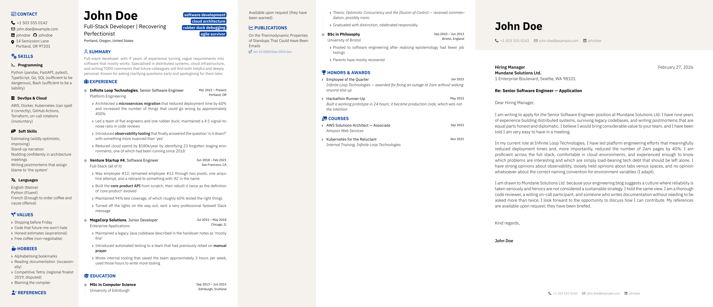

# nabcv

<div align="center">



**A Typst package for not-a-boring CV — data-driven, fully configurable, two-column layout**

[](https://github.com/xrsl/nabcv)
[](LICENSE)
[](https://typst.app)

</div>

---

## Features

- **TOML-driven** — all personal data lives in `.toml` files; the template is a clean, untouched `.typ`
- **Two templates** — `cv` and `letter`, composable into a single `application.typ`
- **Configurable section order** — reorder or drop any sidebar or main-column section
- **Configurable titles & icons** — every section title and icon is overridable without touching source
- **Any social network** — `profiles-config` maps network name → icon + URL base; add Mastodon, Bluesky, etc.
- **i18n-ready** — inject `month-names` and `date-separator` for any locale
- **Open fonts & icons** — IBM Plex Sans + FontAwesome 6 (both open source)
- **Typst-idiomatic** — named parameters, `#show: cv.with(...)` pattern, zero magic

---

## Quick Start

### 1. Initialize from the Typst template

```sh
typst init @preview/nabcv:0.0.0
```

This creates a `template/` folder with `cv.typ`, `letter.typ`, `application.typ` and their corresponding `.toml` data files.

### 2. Install the Tombi VS Code extension (recommended)

[Tombi](https://marketplace.visualstudio.com/items?itemName=tombi-toml.tombi) provides TOML editing with schema-aware autocompletion, validation, and formatting. Install it and point it at the bundled schema:

```json
"tombi.schemas": [
  {
    "fileMatch": ["**/cv.toml"],
    "url": "./schema/schema.json"
  },
  {
    "fileMatch": ["**/letter.toml"],
    "url": "./schema/schema.json"
  }
]
```

### 3. Fill in your data

Edit `template/cv.toml`:

```toml
[cv]
name     = "Jane Smith"
headline = "Software Engineer"
email    = "jane@example.com"
phone    = "+1 555 000 0000"

summary = "Brief professional summary."

[[cv.profiles]]
network  = "LinkedIn"
username = "janesmith"

[[cv.profiles]]
network  = "GitHub"
username = "janesmith"

[[cv.experience]]
company    = "Acme Corp"
position   = "Senior Engineer"
start_date = "2021-03"
end_date   = "present"
highlights = ["Built thing", "Improved other thing"]
```

Edit `template/letter.toml` similarly for your cover letter.

### 4. Compile

```sh
# CV only
typst compile --root . template/cv.typ

# Cover letter only
typst compile --root . template/letter.typ

# CV + letter in one document
typst compile --root . template/application.typ
```

---

## Templates

| File                       | Description                                             |
| -------------------------- | ------------------------------------------------------- |
| `template/cv.typ`          | Standalone CV using `#show: cv.with(...)`               |
| `template/letter.typ`      | Standalone cover letter using `#show: letter.with(...)` |
| `template/application.typ` | CV followed by letter in a single PDF                   |
| `template/cv.toml`         | CV data (personal info, experience, education, …)       |
| `template/letter.toml`     | Letter data (sender, recipient, body paragraphs)        |

---

## Customization

All customization is done in the template `.typ` file via named parameters. Nothing in `src/` needs to be touched.

### Section order

```typst
#show: cv.with(
  ...,
  sidebar-sections: ("contact", "skills", "values", "references"),
  main-sections:    ("experience", "education", "summary", "courses"),
)
```

Omit a key to hide that section entirely.

### Section titles & icons

```typst
#show: cv.with(
  ...,
  section-titles: (awards: "PRIZES & RECOGNITION", experience: "WORK HISTORY"),
  section-icons:  (awards: "medal", experience: "briefcase"),
)
```

Icon names are [FontAwesome 6](https://fontawesome.com/icons) identifiers.

### Social profiles

Any network is supported by extending `profiles-config`:

```typst
#show: cv.with(
  ...,
  profiles-config: (
    LinkedIn:  (icon: "linkedin",  url-base: "https://linkedin.com/in/"),
    GitHub:    (icon: "github",    url-base: "https://github.com/"),
    Mastodon:  (icon: "mastodon",  url-base: "https://mastodon.social/@"),
    Portfolio: (icon: "globe",     url-base: "https://"),
  ),
)
```

### Locale / i18n

```typst
#show: cv.with(
  ...,
  month-names:    ("jan.", "fév.", "mars", "avr.", "mai", "juin",
                   "juil.", "août", "sep.", "oct.", "nov.", "déc."),
  date-separator: " – ",
)
```

### Theming

```typst
#show: cv.with(
  ...,
  theme: (secondary: rgb("#B71C1C"), sidebar-bg: rgb("#FFF8F8")),
)
```

### Other overrides

| Parameter         | Default           | Description                              |
| ----------------- | ----------------- | ---------------------------------------- |
| `bullet-icon`     | `"angle-right"`   | Icon for all list bullets                |
| `address-icon`    | `"location-dot"`  | Icon for address field                   |
| `doi-icon`        | `"external-link"` | Icon on publication DOI links            |
| `show-timeline`   | `true`            | Toggle the experience/education timeline |
| `justify-sidebar` | `false`           | Justify text in the sidebar              |
| `skill-icons`     | _(defaults)_      | Map skill group names to icons           |
| `text-size`       | _(defaults)_      | Override any font size by key            |
| `font-weight`     | _(defaults)_      | Override any font weight by key          |

For the letter:

| Parameter           | Default                          | Description                            |
| ------------------- | -------------------------------- | -------------------------------------- |
| `footer-items`      | `("phone", "email", "linkedin")` | Fields shown in the page footer        |
| `contact-icons`     | _(defaults)_                     | Icon names for contact fields          |
| `contact-url-bases` | _(defaults)_                     | URL prefixes for email/linkedin/github |

---

## TOML Schema

### `cv.toml`

```toml
[cv]
name        = "string"         # required
headline    = "string"         # optional
location    = "string"         # optional
email       = "string"         # optional
phone       = "string"         # optional
address     = ["line1","line2"] # optional, string or array
keywords    = ["tag1","tag2"]  # optional, shown as header badges
summary     = "string"         # optional
motivation  = "string"         # optional
references  = "string"         # optional, or [[cv.references]] array
values      = ["string"]       # optional
hobbies     = ["string"]       # optional

[[cv.profiles]]
network  = "LinkedIn"          # must match a key in profiles-config
username = "yourhandle"

[[cv.skills]]
group = "Programming"
items = "Python, TypeScript, Go"

[[cv.experience]]
company    = "Company Name"
position   = "Job Title"       # optional
start_date = "2022-01"         # YYYY-MM or "present"
end_date   = "present"
location   = "City, Country"   # optional
highlights = ["bullet one"]    # optional

[[cv.education]]               # same shape as experience

[[cv.awards]]
name    = "Award Name"
date    = "2023-06"
summary = "Short description"  # optional

[[cv.courses]]
name    = "Course Name"
date    = "2024-01"
summary = "Issuer or note"     # optional

[[cv.publications]]
title = "Paper Title"
doi   = "10.1234/example"      # optional
```

### `letter.toml`

```toml
[letter.sender]
name     = "Your Name"
email    = "you@example.com"
phone    = "+1 555 000 0000"
linkedin = "yourhandle"        # optional
github   = "yourhandle"        # optional

[letter.recipient]
name    = "Hiring Manager"     # optional
title   = "Engineering Lead"   # optional
company = "Company Name"       # optional
address = "123 Main St"        # optional

[letter.metadata]
date = "auto"                  # "auto" = today, or any string

[letter.content]
subject    = "Application for Software Engineer"
salutation = "Dear Hiring Manager"
closing    = "Kind regards"

[[letter.content.body]]
paragraph = "Opening paragraph text."

[[letter.content.body]]
paragraph = "Second paragraph text."
```

---

## Inspirations

- [brilliant-CV](https://github.com/yunanwg/brilliant-CV) — a well-crafted Typst CV package that inspired the overall structure and development workflow of this project

---

## License

[MIT](LICENSE)
