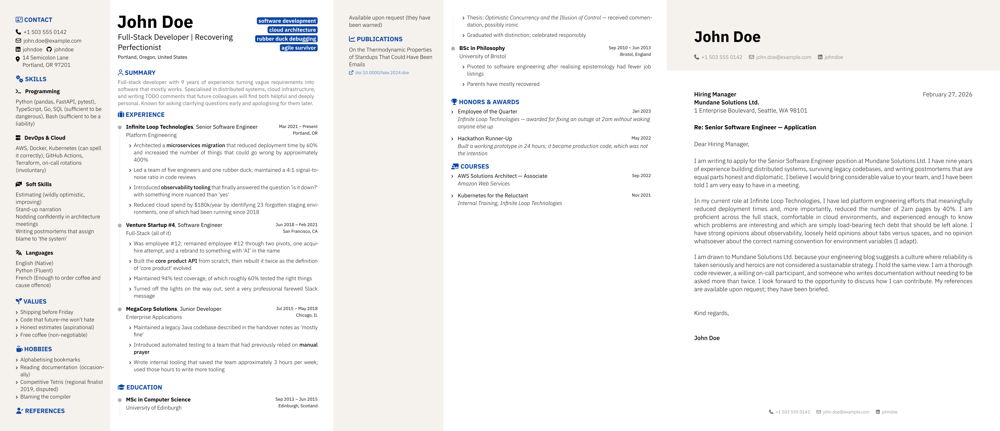

# nabcv

<div align="center">



**A Typst package for not-a-boring CV — data-driven, fully configurable, two-column layout**

[](https://github.com/xrsl/nabcv)
[](LICENSE)
[](https://typst.app)

</div>

A data-driven CV and cover letter package for Typst. All personal data lives in `.yml` or `.toml` files; the template `.typ` files stay clean and untouched. The package exposes two functions — `cv` and `letter` — composable into a single `application.typ`.

## Features

- **Data-driven** — personal data in `.yml` or `.toml` files, no source edits needed
- **Two templates** — `cv` and `letter`, composable into a single `application.typ`
- **Configurable sections** — reorder or drop any sidebar or main-column section
- **Any social network** — `profiles-config` maps network name → icon + URL base
- **i18n** — override `month-names` and `date-separator` for any locale
- **Typst-idiomatic** — named parameters, `#show: cv.with(...)` pattern

## Prerequisites

1. **Typst CLI** — follow the [official instructions](https://github.com/typst/typst#installation).
2. **Fonts** — nabcv requires two font families installed as system fonts:

   **IBM Plex Sans**

   ```sh
   # Debian/Ubuntu (Bookworm+)
   sudo apt install fonts-ibm-plex

   # Manual (all platforms)
   mkdir -p ~/.local/share/fonts/ibm-plex
   curl -L https://github.com/IBM/plex/releases/latest/download/OpenType.zip \
     | unzip -j - "ibm-plex-sans/fonts/complete/ttf/*.ttf" -d ~/.local/share/fonts/ibm-plex/
   fc-cache -f
   ```

   **Font Awesome 7 Free**

   Download the **Free for Desktop** package from [fontawesome.com/download](https://fontawesome.com/download), then:

   ```sh
   mkdir -p ~/.local/share/fonts/font-awesome-7
   # extract the downloaded archive, then:
   cp path/to/fontawesome-free-*-desktop/otfs/*.otf ~/.local/share/fonts/font-awesome-7/
   fc-cache -f
   ```

## Quick Start

### 1. Initialize

```sh
typst init @preview/nabcv:0.1.0
```

This creates a `nabcv/` folder with `cv.typ`, `letter.typ`, `application.typ` and their data files.

### 2. Install editor extensions (optional)

For schema-aware autocompletion and validation:

- **YAML** — [YAML by Red Hat](https://marketplace.visualstudio.com/items?itemName=redhat.vscode-yaml) validates `cv.yml` and `letter.yml` against `schema/schema.json`.
- **TOML** — [Tombi](https://marketplace.visualstudio.com/items?itemName=tombi-toml.tombi) validates `cv.toml` and `letter.toml`.

### 3. Fill in your data

Edit `cv.yml` (default format):

```yaml
cv:
  name: "Jane Smith"
  headline: "Software Engineer"
  email: "jane@example.com"
  phone: "+1 555 000 0000"
  summary: "Brief professional summary."
  profiles:
    - network: LinkedIn
      username: janesmith
  experience:
    - company: "Acme Corp"
      position: "Senior Engineer"
      start_date: "2021-03"
      end_date: "present"
      highlights:
        - "Built thing"
        - "Improved other thing"
```

Or use the TOML equivalent in `cv.toml`:

```toml
[cv]
name     = "Jane Smith"
headline = "Software Engineer"
email    = "jane@example.com"
phone    = "+1 555 000 0000"
summary  = "Brief professional summary."

[[cv.profiles]]
network  = "LinkedIn"
username = "janesmith"

[[cv.experience]]
company    = "Acme Corp"
position   = "Senior Engineer"
start_date = "2021-03"
end_date   = "present"
highlights = ["Built thing", "Improved other thing"]
```

Edit `letter.yml` (or `letter.toml`) similarly for your cover letter.

### 4. Compile

```sh
# YAML data (default)
typst compile cv.typ
typst compile letter.typ
typst compile application.typ

# TOML data
typst compile cv.typ --input fmt=toml
typst compile letter.typ --input fmt=toml
typst compile application.typ --input fmt=toml
```

## Templates

| File               | Description                                             |
| ------------------ | ------------------------------------------------------- |
| `cv.typ`           | Standalone CV using `#show: cv.with(...)`               |
| `letter.typ`       | Standalone cover letter using `#show: letter.with(...)` |
| `application.typ`  | CV followed by letter in a single PDF                   |
| `cv.yml`           | CV data in YAML (personal info, experience, education, …) |
| `letter.yml`       | Letter data in YAML (sender, recipient, body paragraphs)  |
| `cv.toml`          | CV data in TOML (alternative format, `--input fmt=toml`)  |
| `letter.toml`      | Letter data in TOML (alternative format)                  |

## Layouts

The CV offers four header layouts, selectable without touching any `.typ` file — either from the command line or from the `meta:` block of your data file.

| Layout | Flags | Description |
| ------ | ----- | ----------- |
| **Standard** | _(none)_ | Name and headline at the top of the main column, photo and contact in the tinted sidebar |
| **Header band** | `header-band: true` | Full-width header: round photo on the left (sized to the text block height), name, headline and a one-line contact row; no sidebar tint |
| **ATS split** | `ats-split: true` | Two-column header (photo left, name/headline right), sidebar keeps the tint; friendlier to ATS parsers |

The header band can be tuned further: `header-band-summary: true` moves the summary into the band, and `header-band-contact: false` keeps the contact section in the sidebar instead of the band's contact line.

Via command line:

```sh
typst compile cv.typ --input header-band=true --input keywords-lines=3
```

Or via the `meta:` block in `cv.yml` (command-line inputs take priority):

```yaml
meta:
  photo: photo.jpg           # path to your photo
  locale: fr                 # translates section titles and month names
  header-band: true          # pick a layout
  header-band-summary: true  # summary inside the band
  keywords-lines: 3          # distribute keyword badges over 3 lines
```

Available meta/input keys: `data`, `fmt`, `photo`, `locale` (`en`/`fr`), `header-band`, `header-band-summary`, `header-band-contact`, `ats-split`, `keywords-lines` (0 = one badge per line).

## Customization

All customization is done through named parameters in the template `.typ` file. Nothing in `src/` needs to be touched.

### Section order

```typ
#show: cv.with(
  ...,
  sidebar-sections: ("contact", "skills", "values", "references"),
  main-sections:    ("experience", "education", "summary", "courses"),
)
```

Omit a key to hide that section entirely.

### Section titles & icons

```typ
#show: cv.with(
  ...,
  section-titles: (awards: "PRIZES & RECOGNITION", experience: "WORK HISTORY"),
  section-icons:  (awards: "medal", experience: "briefcase"),
)
```

Icon names are [FontAwesome 7](https://fontawesome.com/icons) identifiers.

### Social profiles

```typ
#show: cv.with(
  ...,
  profiles-config: (
    LinkedIn:  (icon: "linkedin",  url-base: "https://linkedin.com/in/"),
    GitHub:    (icon: "github",    url-base: "https://github.com/"),
Portfolio: (icon: "globe",     url-base: "https://"),
  ),
)
```

### Locale / i18n

```typ
#show: cv.with(
  ...,
  month-names:    ("jan.", "fév.", "mars", "avr.", "mai", "juin",
                   "juil.", "août", "sep.", "oct.", "nov.", "déc."),
  date-separator: " – ",
)
```

### Theming

```typ
#show: cv.with(
  ...,
  theme: (secondary: rgb("#B71C1C"), sidebar-bg: rgb("#FFF8F8")),
)
```

Available keys:

| Key | Default | Description |
| --- | ------- | ----------- |
| `primary` | `#000000` | Main text colour |
| `secondary` | `#0D47A1` | Section titles and keyword badges |
| `accent` | `#000000` | Dates, entry summaries, headline |
| `links` | `#1565C0` | Hyperlinks |
| `sidebar-bg` | `#F5F1ED` | Sidebar tint (standard and ats-split layouts) |
| `summary` | `#6B6B6B` | Summary text and header contact line |
| `header-bg` | `white` | Header band background (`none` = transparent) |
| `header-rule` | `none` | Horizontal rule under the header band |
| `sidebar-rule` | `none` | Vertical rule between the columns (header-band layouts) |

With header-band layouts the sidebar tint is dropped; set `header-rule` and/or `sidebar-rule` to a colour (e.g. `rgb("#D5D5D5")`) to draw separators instead.

### Other parameters

| Parameter          | Default           | Description                              |
| ------------------ | ----------------- | ---------------------------------------- |
| `show-header-band` | `false`           | Full-width header band layout (photo at its left) |
| `header-band-summary` | `false`        | Summary inside the header band           |
| `header-band-contact` | `true`         | Contact line in the band (false = sidebar) |
| `ats-split`        | `false`           | Two-column header layout                 |
| `keywords-lines`   | `auto`            | Lines for keyword badges (`auto` = one per line) |
| `photo-size`       | `70%`             | Photo diameter as a fraction of sidebar width (ignored by the header band, which sizes the photo to the text block height) |
| `bullet-icon`      | `"angle-right"`   | Icon for all list bullets                |
| `address-icon`     | `"location-dot"`  | Icon for address field                   |
| `doi-icon`         | `"external-link"` | Icon on publication DOI links            |
| `show-timeline`    | `true`            | Toggle the experience/education timeline |
| `justify-sidebar`  | `false`           | Justify text in the sidebar              |
| `skill-icons`      | _(defaults)_      | Map skill group names to icons           |
| `text-size`        | _(defaults)_      | Override any font size by key            |
| `font-weight`      | _(defaults)_      | Override any font weight by key          |

For the letter:

| Parameter           | Default                          | Description                            |
| ------------------- | -------------------------------- | -------------------------------------- |
| `footer-items`      | `("phone", "email", "linkedin")` | Fields shown in the page footer        |
| `contact-icons`     | _(defaults)_                     | Icon names for contact fields          |
| `contact-url-bases` | _(defaults)_                     | URL prefixes for email/linkedin/github |

## Development

### Setup

```sh
git clone https://github.com/xrsl/nabcv
cd nabcv
make build          # compile examples + personal CVs in content/
make watch          # live preview (typst watch)
make build-examples # compile template/examples/ only
make build-layouts  # compile the header layout variants side by side
```

Personal data files go in `content/` (gitignored). Name them `cv-<slug>.yml` or `letter-<slug>.yml` — `make build` picks them up automatically.

### Dependencies

| Tool | Purpose |
| ---- | ------- |
| `typst` | Compiler |
| `make` | Build orchestration |
| `cue` | Schema authoring (`make schema`) |
| `bump-my-version` | Version bumping (`make bump-patch`) |
| `cspell` | Spell checking (`make spell`) |
| `imagemagick` | Thumbnail generation (`make thumbs`) |

A `shell.nix` is provided for a reproducible environment with all tools and font paths pre-configured.

### Claude Code (nono sandbox)

If you use [Claude Code](https://claude.ai/code) with the [nono](https://github.com/always-further/nono) sandbox, a ready-made profile is included at `.claude/nono-profile-claude-typst.json`. It grants the sandbox access to the Typst package cache and system fonts.

```sh
cp .claude/nono-profile-claude-typst.json ~/.config/nono/profiles/claude-typst.json
nono run --profile claude-typst -- claude
```

## Inspirations

- [brilliant-CV](https://github.com/yunanwg/brilliant-CV) — a well-crafted Typst CV package that inspired the overall structure and development workflow of this project
- [hipster-cv](https://github.com/latex-ninja/hipster-cv) — a LaTeX CV template that inspired the two-column sidebar design
- [acadennial-cv](https://github.com/whliao5am/acadennial-cv-typst-template) — a Typst academic CV template

## License

[MIT](LICENSE)
